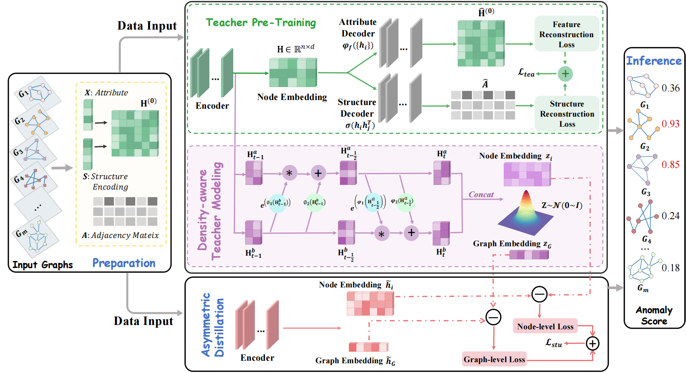

# FANFOLD: Graph Normalization Flows Driven Asymmetric Network for Unsupervised Graph-Level Anomaly Detection

# Requirements
* Python==3.8
* Pytorch==2.2.1+cu121
Pytorch Geometric==2.5.2
Numpy==1.24.3
Scikit-learn==1.3.2
OGB==1.3.6
NetworkX==3.1
